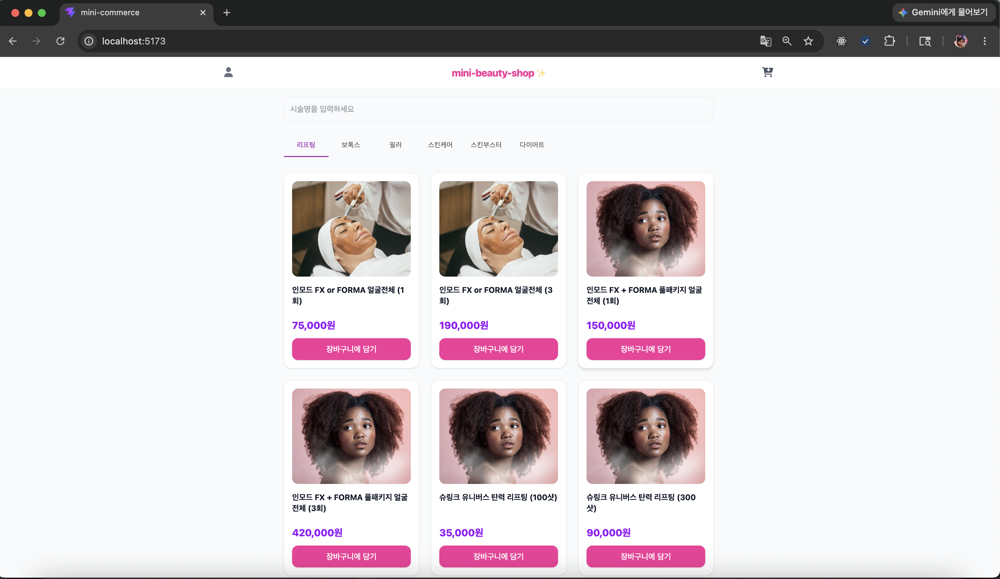
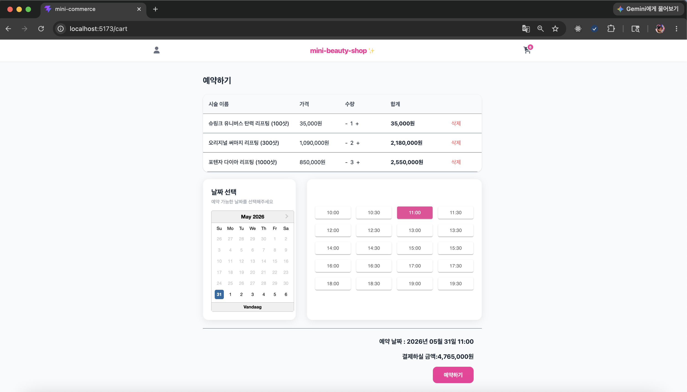
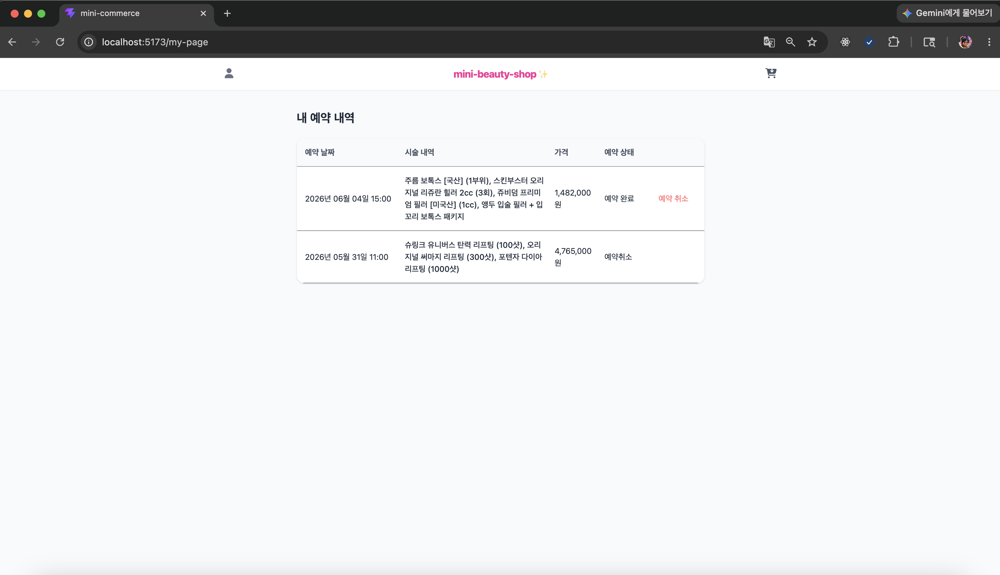

# 💄 Mini Beauty Shop (예약 서비스)

뷰티 시술 예약 서비스를 가정하여 만든 React 기반 사이드 프로젝트입니다.

기존에 사용하던 Vue(Quasar) 환경에서 React로 전환하며 상태 관리, 라우팅, API Mocking, 테스트 자동화 등 React 생태계를 학습하고 적용하는 데 집중했습니다.

## 📷 화면

### 메인 화면

### 장바구니

### 예약 내역

---

## 🎯 주요 기능

- [x] 시술 목록 조회
- [x] 카테고리별 시술 탐색
- [x] 시술 검색
- [x] 장바구니 추가 / 삭제
- [x] 수량 변경
- [x] 예약 생성
- [x] 예약 조회
- [x] 예약 취소

## 🛠 Tech Stack

| 분야             | 기술                        |
| ---------------- | --------------------------- |
| Frontend         | React, TypeScript, Vite     |
| State Management | Zustand, Persist Middleware |
| Routing          | React Router                |
| API Mocking      | MSW                         |
| Testing          | Cypress                     |
| UI               | Material UI (MUI)           |

## ⚙️ 기술적 선택

### Zustand

장바구니 정보가 여러 컴포넌트에서 공유되어야 했기 때문에 전역 상태 관리 라이브러리인 Zustand를 사용했습니다.
또한 persist 미들웨어를 활용하여 새로고침 이후에도 장바구니 상태가 유지되도록 구현했습니다.

### MSW

백엔드 서버 없이도 실제 API와 동일한 방식으로 개발하기 위해 MSW(Mock Service Worker)를 적용했습니다.
GET, POST, PATCH 요청을 Mock API로 구현하여 예약 생성 및 예약 취소 기능을 테스트했습니다.

### Cypress

예약 서비스 특성상 여러 화면을 거치는 사용자 흐름 검증이 중요하다고 판단했습니다.
상품 검색 → 장바구니 → 예약 → 예약 취소까지의 시나리오를 E2E 테스트로 자동화했습니다.

## 🧪 E2E 테스트 시나리오

- 상품 검색
- 장바구니 추가
- 수량 변경
- 상품 삭제
- 예약 날짜 선택
- 예약 생성
- 예약 완료 확인
- 예약 취소

## 📚 기술 블로그

### 프로젝트를 진행하며 마주한 문제와 해결 과정을 정리했습니다.

| 주제             | 내용                                                                          |
| ---------------- | ----------------------------------------------------------------------------- |
| React Router     | [Link와 useNavigate 차이](https://en-joy-coding.tistory.com/125)              |
| MUI Tabs         | [e.target.value를 사용할 수 없는 이유](https://en-joy-coding.tistory.com/123) |
| React DatePicker | [설치 및 주요 옵션 정리](https://en-joy-coding.tistory.com/126)               |
| MSW              | [Mock API 적용하기](https://en-joy-coding.tistory.com/127)                    |
| Cypress          | [예약 기능 E2E 테스트](https://en-joy-coding.tistory.com/128)                 |
| Zustand          | [persist를 활용한 상태 유지](https://en-joy-coding.tistory.com/129)           |

## 📝 배운 점

- React 환경에서의 상태 관리 패턴 이해
- Mock API를 활용한 독립적인 개발 환경 구축
- E2E 테스트 자동화를 통한 사용자 시나리오 검증 경험
- 휘발성 상태와 지속성 상태의 차이 및 활용 방법 학습
